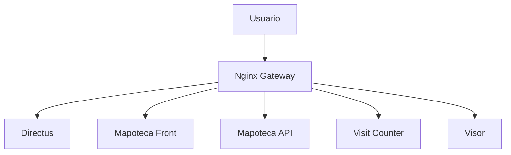

# Despliegue Unificado en Docker - SIG Quindio

Esta guia describe como desplegar todos los aplicativos del proyecto en el mismo despliegue Docker donde actualmente esta Directus, usando un unico `docker-compose` y un Nginx de entrada como reverse proxy.

Aplicativos incluidos:

- Frontend Mapoteca (React)
- API Mapoteca (NestJS)
- Visit Counter Backend (Node.js)
- Visor (app estatica)
- Directus CMS (existente)

## 1. Objetivo tecnico

Consolidar todos los servicios en una sola orquestacion Docker para que queden en:

- Misma red Docker
- Mismo archivo `docker-compose`
- Un solo punto de entrada HTTP/HTTPS (Nginx)
- Rutas separadas por prefijo

Nota: en Docker, cada aplicativo corre en su propio contenedor por buenas practicas. "Mismo contenedor" en este documento se implementa como mismo despliegue/stack Docker administrado en conjunto.

## 2. Arquitectura propuesta



## 3. Estructura esperada del repositorio

```text
SIG_QUINDIO/
├── docker/
│   ├── docker-compose.yml
│   ├── .env
│   └── nginx/
│       └── nginx.conf
├── directus/
├── Mapoteca_sig-quindio-react-completo/
├── mapoteca-api/
├── visit-counter-backend/
└── Visor/
```

## 4. Paso a paso

## 4.1. Preparar Dockerfile por aplicativo

Asegure que cada aplicativo tenga su Dockerfile en su raiz:

- `docker/directus/Dockerfile` (ya existe en el proyecto)
- `Mapoteca_sig-quindio-react-completo/Dockerfile`
- `mapoteca-api/Dockerfile`
- `visit-counter-backend/Dockerfile`
- `Visor/Dockerfile`

Use como base las guias ya existentes:

- `Mapoteca_sig-quindio-react-completo/DOCKER_DEPLOYMENT_Front_Mapoteca.md`
- `mapoteca-api/DESPLIEGUE_DOCKER_API_Mapoteca.md`
- `visit-counter-backend/DESPLIEGUE_DOCKER_PRODUCCION_VisitCounter.md`
- `Visor/DESPLIEGUE_DOCKER_PRODUCCION_Visor.md`

## 4.2. Unificar variables de entorno

En `docker/.env` centralice variables de todos los servicios.

Ejemplo base:

```env
# ===== DIRECTUS =====
KEY=
SECRET=
ADMIN_EMAIL=
ADMIN_PASSWORD=
PUBLIC_URL=http://localhost
DB_CLIENT=oracledb
DB_HOST=
DB_PORT=
DB_SERVICE=
DB_USER=
DB_PASSWORD=
DB_CONNECT_STRING=

# ===== MAPOTECA API =====
MAPOTECA_API_PORT=3000
DIRECTUS_URL=http://directus:8055
DIRECTUS_ROOT_FOLDER=Mapoteca
DIRECTUS_USER=
DIRECTUS_PASSWORD=

# ===== VISIT COUNTER =====
VISIT_HTTP_PORT=3002
VISIT_HTTPS_PORT=3003
ADMIN_SECRET_TOKEN=
SSL_KEY_PATH=./certs/server-key.pem
SSL_CERT_PATH=./certs/server-cert.pem
SSL_CA_PATH=

# ===== RUTAS/DOMINIO =====
SIG_DOMAIN=localhost
```

## 4.3. Reemplazar `docker/docker-compose.yml` por una version unificada

Use esta plantilla como base (ajuste rutas y nombres si aplica):

```yaml
services:
  directus:
    build:
      context: ../
      dockerfile: docker/directus/Dockerfile
    container_name: directus-sigquindio
    restart: unless-stopped
    env_file:
      - .env
    volumes:
      - ../directus/uploads:/app/uploads
      - ../directus/extensions:/app/extensions
    expose:
      - "8055"
    networks:
      - sig-network

  mapoteca-api:
    build:
      context: ../mapoteca-api
      dockerfile: Dockerfile
    container_name: mapoteca-api-sigquindio
    restart: unless-stopped
    env_file:
      - .env
    environment:
      PORT: 3000
      DIRECTUS_URL: http://directus:8055
    expose:
      - "3000"
    depends_on:
      - directus
    networks:
      - sig-network

  mapoteca-front:
    build:
      context: ../Mapoteca_sig-quindio-react-completo
      dockerfile: Dockerfile
    container_name: mapoteca-front-sigquindio
    restart: unless-stopped
    expose:
      - "80"
    networks:
      - sig-network

  visit-counter:
    build:
      context: ../visit-counter-backend
      dockerfile: Dockerfile
    container_name: visit-counter-sigquindio
    restart: unless-stopped
    env_file:
      - .env
    volumes:
      - ../visit-counter-backend/data:/app/data
      - ../visit-counter-backend/certs:/app/certs:ro
    expose:
      - "3002"
      - "3003"
    networks:
      - sig-network

  visor:
    build:
      context: ../Visor
      dockerfile: Dockerfile
    container_name: visor-sigquindio
    restart: unless-stopped
    expose:
      - "80"
    networks:
      - sig-network

  nginx:
    image: nginx:alpine
    container_name: nginx-sigquindio
    restart: unless-stopped
    ports:
      - "80:80"
      - "443:443"
    volumes:
      - ./nginx/nginx.conf:/etc/nginx/nginx.conf:ro
    depends_on:
      - directus
      - mapoteca-api
      - mapoteca-front
      - visit-counter
      - visor
    networks:
      - sig-network

networks:
  sig-network:
    driver: bridge
```

## 4.4. Configurar `docker/nginx/nginx.conf` para enrutar todos los servicios

Ejemplo de configuracion unificada por prefijos:

```nginx
worker_processes 1;

events {
  worker_connections 1024;
}

http {
  include       mime.types;
  default_type  application/octet-stream;
  sendfile on;
  client_max_body_size 200M;

  server {
    listen 80;
    server_name _;

    # Directus
    location / {
      proxy_pass http://directus:8055;
      proxy_http_version 1.1;
      proxy_set_header Host $host;
      proxy_set_header X-Real-IP $remote_addr;
      proxy_set_header X-Forwarded-For $proxy_add_x_forwarded_for;
      proxy_set_header X-Forwarded-Proto $scheme;
      proxy_set_header Upgrade $http_upgrade;
      proxy_set_header Connection "upgrade";
    }

    # Websocket Directus
    location /websocket {
      proxy_pass http://directus:8055/websocket;
      proxy_http_version 1.1;
      proxy_set_header Upgrade $http_upgrade;
      proxy_set_header Connection "upgrade";
      proxy_set_header Host $host;
    }

    # Front Mapoteca
    location /mapoteca/ {
      rewrite ^/mapoteca/(.*)$ /$1 break;
      proxy_pass http://mapoteca-front;
      proxy_set_header Host $host;
      proxy_set_header X-Real-IP $remote_addr;
      proxy_set_header X-Forwarded-For $proxy_add_x_forwarded_for;
      proxy_set_header X-Forwarded-Proto $scheme;
    }

    # API Mapoteca
    location /api/mapoteca/ {
      rewrite ^/api/mapoteca/(.*)$ /$1 break;
      proxy_pass http://mapoteca-api:3000;
      proxy_set_header Host $host;
      proxy_set_header X-Real-IP $remote_addr;
      proxy_set_header X-Forwarded-For $proxy_add_x_forwarded_for;
      proxy_set_header X-Forwarded-Proto $scheme;
    }

    # Visit Counter (HTTP interno)
    location /api/visits/ {
      rewrite ^/api/visits/(.*)$ /api/visits/$1 break;
      proxy_pass http://visit-counter:3002;
      proxy_set_header Host $host;
      proxy_set_header X-Real-IP $remote_addr;
      proxy_set_header X-Forwarded-For $proxy_add_x_forwarded_for;
      proxy_set_header X-Forwarded-Proto $scheme;
    }

    # Visor
    location /visor/ {
      rewrite ^/visor/(.*)$ /$1 break;
      proxy_pass http://visor;
      proxy_set_header Host $host;
      proxy_set_header X-Real-IP $remote_addr;
      proxy_set_header X-Forwarded-For $proxy_add_x_forwarded_for;
      proxy_set_header X-Forwarded-Proto $scheme;
    }
  }
}
```

## 4.5. Ajustes clave por aplicativo

### Directus

- Mantener volumenes actuales:
  - `../directus/uploads:/app/uploads`
  - `../directus/extensions:/app/extensions`
- Mantener conectividad a Oracle con variables ya usadas en `docker/.env`.

### Front Mapoteca

- Configurar base URL de API para consumir `\/api\/mapoteca` desde el mismo dominio del gateway Nginx.
- Confirmar que el build genera artefactos en `dist/`.

### API Mapoteca

- Mantener `DIRECTUS_URL=http://directus:8055` (comunicacion interna por nombre de servicio).
- Exponer solo interno (`expose`) y no publicar puerto al host.

### Visit Counter

- Mantener volumen persistente en `data/`.
- Montar `certs/` en modo lectura.
- Publicar internamente `3002` y `3003`, pero enrutar desde Nginx por `3002` para trafico interno HTTP.

### Visor

- Si se publica en subruta `/visor/`, ajustar:
  - `base href`
  - `mountPath`
  - rutas de recursos CDN
- Verificar que `index.html` y `/cdn/32/*` carguen correctamente desde esa subruta.

## 4.6. Construccion y arranque

Desde `docker/` ejecutar:

```bash
docker compose down
docker compose build --no-cache
docker compose up -d
```

Verificar estado:

```bash
docker compose ps
docker compose logs -f nginx
docker compose logs -f directus
docker compose logs -f mapoteca-api
docker compose logs -f visit-counter
docker compose logs -f visor
```

## 4.7. Validaciones funcionales

Validar rutas publicas:

- `http://localhost/` -> Directus
- `http://localhost/mapoteca/` -> Front Mapoteca
- `http://localhost/api/mapoteca/` -> API Mapoteca
- `http://localhost/api/visits/health` o `http://localhost/api/health` segun implementacion real
- `http://localhost/visor/` -> Visor

Pruebas recomendadas:

```bash
curl -I http://localhost/
curl -I http://localhost/mapoteca/
curl -I http://localhost/api/mapoteca/
curl -I http://localhost/visor/
```

## 4.8. Operacion, actualizaciones y rollback

Actualizacion de un servicio puntual:

```bash
docker compose build mapoteca-api
docker compose up -d mapoteca-api
```

Rollback rapido:

1. Restaurar commit/tag previo de configuracion.
2. Ejecutar `docker compose up -d --build`.

## 5. Seguridad recomendada para produccion

- Terminar TLS en Nginx (puerto 443) con certificados validos.
- No exponer puertos internos de servicios al host salvo Nginx.
- No versionar secretos en `.env`.
- Restringir acceso administrativo a Directus.
- Mantener backups de:
  - `directus/uploads`
  - `directus/extensions`
  - `visit-counter-backend/data`

## 6. Checklist final

1. Dockerfiles existentes y validados para los 5 aplicativos.
2. `docker/docker-compose.yml` unificado actualizado.
3. `docker/nginx/nginx.conf` con rutas por prefijo.
4. `docker/.env` con variables completas.
5. `docker compose up -d` sin errores.
6. Todos los servicios en estado `running`.
7. Validacion funcional de rutas completada.
8. Logs sin errores de conexion entre contenedores.

## 7. Referencias internas del proyecto

- `README.md`
- `Mapoteca_sig-quindio-react-completo/DOCKER_DEPLOYMENT_Front_Mapoteca.md`
- `mapoteca-api/DESPLIEGUE_DOCKER_API_Mapoteca.md`
- `visit-counter-backend/DESPLIEGUE_DOCKER_PRODUCCION_VisitCounter.md`
- `Visor/DESPLIEGUE_DOCKER_PRODUCCION_Visor.md`
